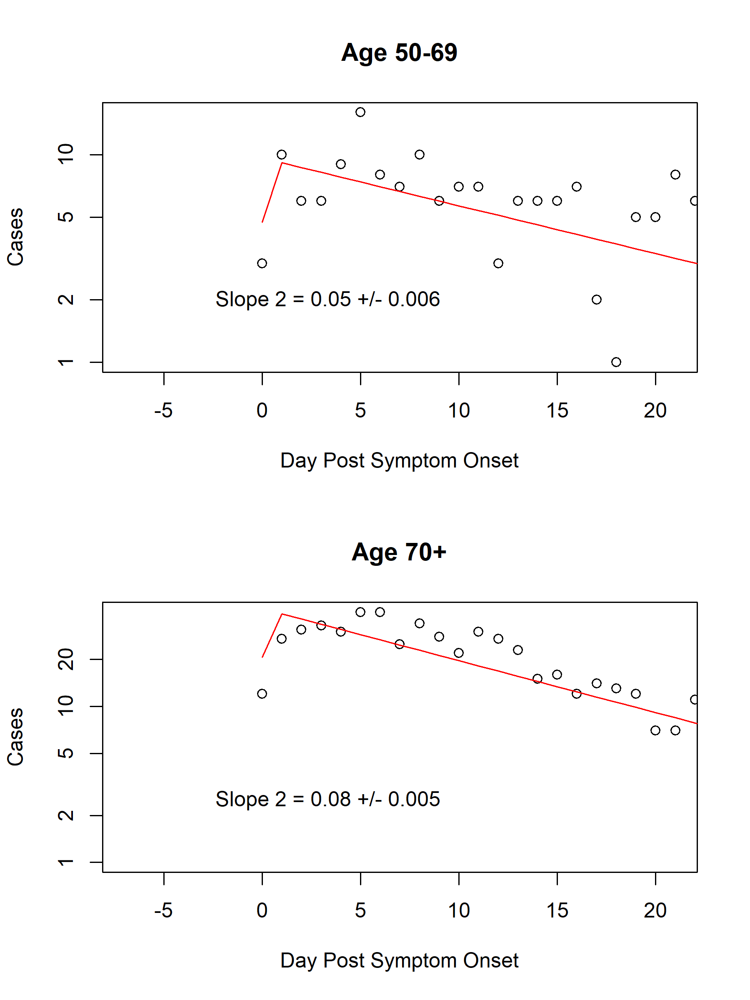
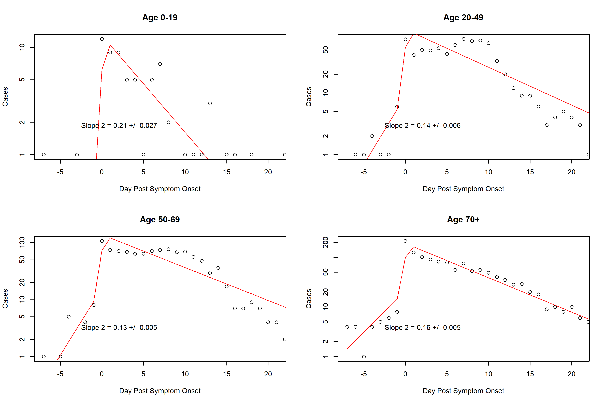
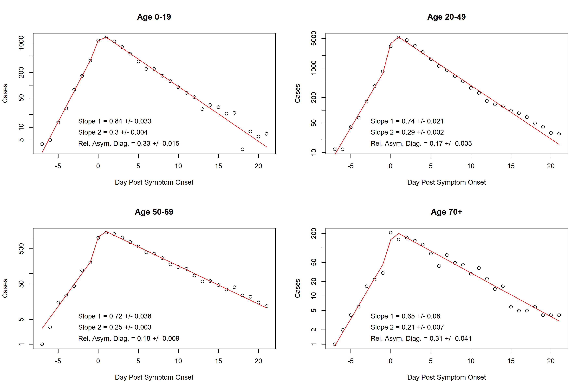
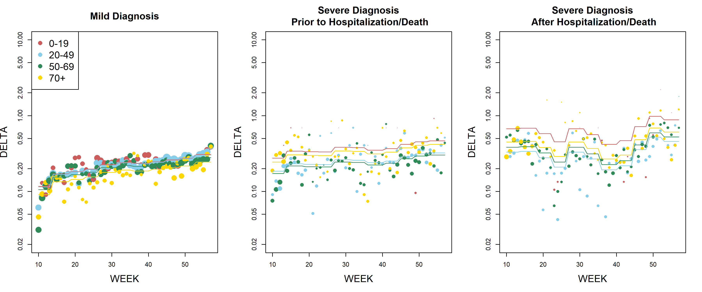

#Introduction
The purpose of this analysis is to perform a "quick" analysis of the King County Line Data to extract as many relevant model parameters as possible. Due to the simplifying assumptions made here, many of the parameters will have to be refit.


```{r Load Data, echo = FALSE, message = FALSE, warning = FALSE}
library(lubridate)
library(data.table)

load("monthly_rates.Rdata")
load("../Aggregated KC Data/KINGCOV_DATA_AUG_WEEKLY.Rdata")
load("diagnosis.data.Rdata")

KINGCOV_DATA_AUG_WEEKLY$MONTH = month(KINGCOV_DATA_AUG_WEEKLY$STARTDT) + 12 * (year(KINGCOV_DATA_AUG_WEEKLY$STARTDT) - 2020)
COMBINED_DATA_RESULTS = merge(monthly.rates, KINGCOV_DATA_AUG_WEEKLY)
```

# Hospitalization Fatality Rate

First we estimate hospitalization fatality rate vs time using logistic regression. We assume
that the HFR depends on both age and the month of hospitalization.

\begin{align}
\text{logit(HFR)} = \beta_{\text{AGE}} + \beta_{\text{Month Admitted}}
\end{align}

The resulting fit shows a steadily decreasing HFR, although it has been largely stable since the summer \@ref(fig:HFRPlot). Note that I did not account for possible censoring so it is better to use the numbers from December than January (as the deaths from January admits will be incomplete)

```{r HFRPlot, echo = F, fig.cap = "Hospital fatality rate vs week. Dots show the proportion of individual admitted to hospital in a particular week with a recorded death data. Line shows the monthly fit from logistic regression."}
MONTHS_TO_SHOW = seq(3, 13)

col.list = c("indianred", "skyblue", "seagreen", "gold")
plot(I(PRE_DEATH_HOSPITALIZATION/(PRE_DEATH_HOSPITALIZATION + NO_DEATH_HOSPITALIZATION))~WEEK, 
     data = COMBINED_DATA_RESULTS,
     col = col.list[AGEGR + 1], 
     subset = MONTH %in% MONTHS_TO_SHOW,
     pch = 16,
     cex = log(PRE_DEATH_HOSPITALIZATION + NO_DEATH_HOSPITALIZATION + 1)/3,
     ylab = "HFR")
     #log = 'y',
     #ylim = c(.005, 1))
lines(HFR~WEEK, data = COMBINED_DATA_RESULTS, col = col.list[1],
      subset = AGEGR == 0 &  MONTH %in% MONTHS_TO_SHOW)

lines(HFR~WEEK, data = COMBINED_DATA_RESULTS, col = col.list[2],
      subset = AGEGR == 1 &  MONTH %in% MONTHS_TO_SHOW)

lines(HFR~WEEK, data = COMBINED_DATA_RESULTS, col = col.list[3],
      subset = AGEGR == 2 &  MONTH %in% MONTHS_TO_SHOW)

lines(HFR~WEEK, data = COMBINED_DATA_RESULTS, col = col.list[4],
      subset = AGEGR == 3 &  MONTH %in% MONTHS_TO_SHOW)
```


```{r}
library(plyr)
get.monthly.table = function(x){
  c("Month Name" = ifelse(x$MONTH[1]<13, 
                          paste0(month.name[x$MONTH[1]], ", 2020"),
                          paste0(month.name[x$MONTH[1] - 12], ", 2021")),
    "Age GR 1" = round(x$HFR[1] * 100, 1),
    "Age GR 2" = round(x$HFR[2] * 100, 1),
    "Age GR 3" = round(x$HFR[3] * 100, 1),
    "Age GR 4" = round(x$HFR[4] * 100, 1)
  )
}

output.plot = ddply(monthly.rates, .var = "MONTH", get.monthly.table)

knitr::kable(output.plot[,-1], booktabs = TRUE, caption = "Estimated HFR by month (%)")
```

# Time from Hospitalization to Death

The negative slopes of the lines in \@ref(fig:hospdeath) give the sum of recovery and death ($\delta_H + \rho_H$). The steeper slope among older people potentially suggests a faster death rate rather than a lower recovery rate. When choosing parameters, note that

$$
\delta_H = \text{HFR} * \text{Slope}\\
\rho_H = (1 - \text{HFR}) * \text{Slope}
$$

```{r hospdeath, echo = F, fig.cap = "Time from hospitalization to death"}

```


# Time from Symptom Onset to hospitalization

The negative slopes of the lines in \@ref(fig:symptomhosp) give the sum of death and hospitalization (note that we assume that recovery is not possible for these people) ($\delta_{NH} + \eta$). I have not yet investigated what is behind the change in the fraction of people dying outside of hospitals.


```{r symptomhosp, echo = F, fig.cap = "Time from symptom onset to hospitalization"}

```


# Time from Symptom Onset to diagnosis
The positive slopes of the lines in \@ref(fig:symptomdiag) is $\gamma_2 + \Delta_A$ whereas the negative slopes are $\rho + \Delta$.

We can also extract the ratio $\Delta_A/\Delta$ using a biexponential model. (NEED TO SHOW) Note that this analysis assumes that all of these parameters are constant in time, which we shall see shortly is likely a reasonable approximation, but is not exact.

```{r symptomdiag, echo = F, fig.cap = "Time from symptom onset to diagnosis"}

```


# Diagnostic Rate
By analyzing the waiting times plotted in \@ref(symptomdiag) we can derive a time verying diagnosis rate \@ref(diagrate). This approximation relies on exponentially distributed waiting time (which seems to be empirically true) as well as a slow recovery rate (a value of roughly 1/7 was assumed). A higher recovery rate would distort these rates.

```{r diagrate, echo = F, fig.cap = "Diagnosis rate by month and age group"}

```


```{r}
get.monthly.table = function(x){
  c("Month Name" = ifelse(x$MONTH[1]<13, 
                          paste0(month.name[x$MONTH[1]], ", 2020"),
                          paste0(month.name[x$MONTH[1] - 12], ", 2021")),
    "Age 1" = round(x$diagnostic.rate[1], 2),
    "Age 2" = round(x$diagnostic.rate[2], 2),
    "Age 3" = round(x$diagnostic.rate[3], 2),
    "Age 4" = round(x$diagnostic.rate[4], 2)
  )
}

output.plot = ddply(diagnostic.rates, .var = c("MONTH", "SEVERITY"), get.monthly.table)

knitr::kable(output.plot[,-1], booktabs = TRUE, caption = "Diagnostic rate (1/day)")
```

#Fraction Severe
Probably the trickiest parameter to extract from the data is the fraction of symptomatic infections which are severe ($1 - m$ in the model). Severe cases are defined to be those with a hospitalization and/or death event. We can readily extract the fraction of cases with a severe event \@ref(fig:SEVPlot) but this will be an overestimate of the severe fraction due to underascertainment of mild cases and asymptomatic cases.


```{r SEVPlot, echo = F, fig.cap = "Hospital fatality rate vs week. Dots show the proportion of individual admitted to hospital in a particular week with a recorded death data. Line shows the monthly fit from logistic regression."}
MONTHS_TO_SHOW = seq(3, 13)

col.list = c("indianred", "skyblue", "seagreen", "gold")
plot(I(1 - CASES_NO_DEATH_NO_HOSPITALIZATION/CASES.y)~WEEK, 
     data = COMBINED_DATA_RESULTS,
     col = col.list[AGEGR + 1], 
     subset = MONTH %in% MONTHS_TO_SHOW,
     pch = 16,
     cex = log(CASES.y + 1)/3,
     ylab = "Fraction Severe Cases")
     #log = 'y',
     #ylim = c(.005, 1))
lines(Severe~WEEK, data = COMBINED_DATA_RESULTS, col = col.list[1],
      subset = AGEGR == 0 &  MONTH %in% MONTHS_TO_SHOW)

lines(Severe~WEEK, data = COMBINED_DATA_RESULTS, col = col.list[2],
      subset = AGEGR == 1 &  MONTH %in% MONTHS_TO_SHOW)

lines(Severe~WEEK, data = COMBINED_DATA_RESULTS, col = col.list[3],
      subset = AGEGR == 2 &  MONTH %in% MONTHS_TO_SHOW)

lines(Severe~WEEK, data = COMBINED_DATA_RESULTS, col = col.list[4],
      subset = AGEGR == 3 &  MONTH %in% MONTHS_TO_SHOW)
```


Using the diagnostic rates from the previous sections, as well as an estimate of the proportion of cases which are asymptomatic (I use the number 1/3 as I think it better reflects the available data), I derived the month-by-month estimates of severe fraction below.


```{r}
library(plyr)
get.monthly.table = function(x){
  c("Month Name" = ifelse(x$MONTH[1]<13, 
                          paste0(month.name[x$MONTH[1]], ", 2020"),
                          paste0(month.name[x$MONTH[1] - 12], ", 2021")),
    "Age GR 1" = round(x$Severe.True[1] * 100, 1),
    "Age GR 2" = round(x$Severe.True[2] * 100, 1),
    "Age GR 3" = round(x$Severe.True[3] * 100, 1),
    "Age GR 4" = round(x$Severe.True[4] * 100, 1)
  )
}

output.plot = ddply(monthly.rates, .var = "MONTH", get.monthly.table)

knitr::kable(output.plot[,-1], booktabs = TRUE, caption = "Fraction of symptomatic infection which is severe (%)")
```