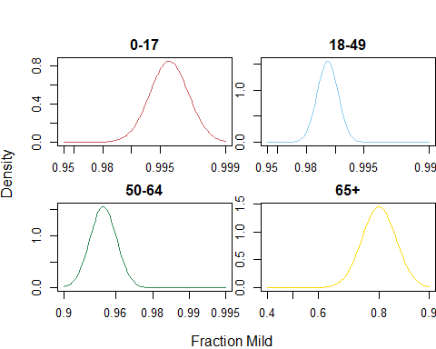
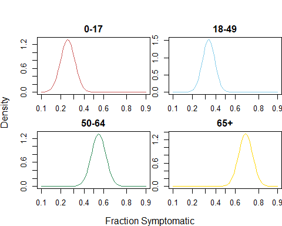
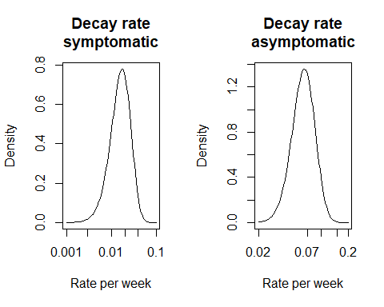
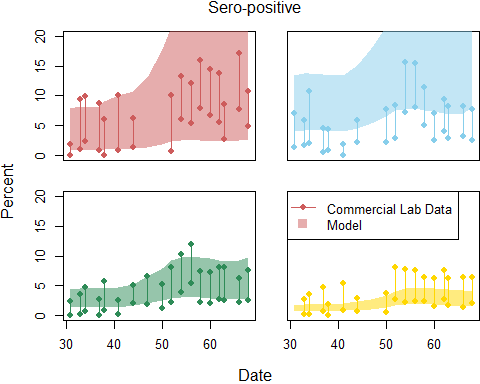
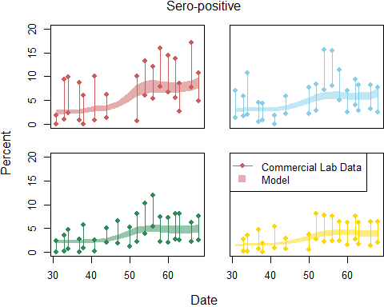
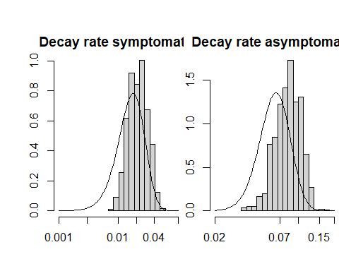
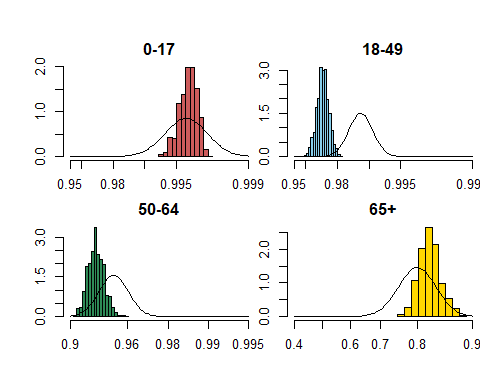
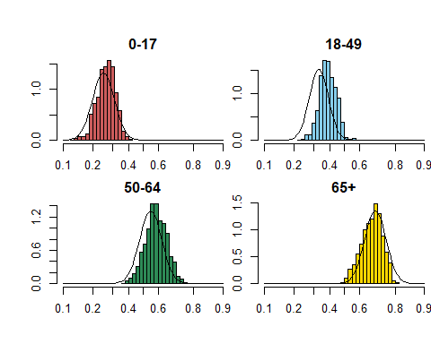
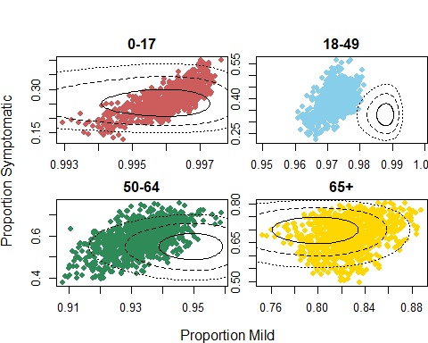

\newcommand{\Severe}{\text{S}}
\newcommand{\Mild}{\text{M}}
\newcommand{\Asymptomatic}{\text{A}}
\newcommand{\Hosp}{\text{H}}
\newcommand{\NHD}{\text{NHD}}

\newcommand{\decayA}{d_1}
\newcommand{\decayS}{d_2}

\newcommand{\cum}{\text{C}}
\newcommand{\sp}{\text{SP}}


```
## Warning: package 'scales' was built under R version 4.0.3
```
# Summary

Here we compare Washington Sero-prevalence data to what would be predicted based on an unchanging hospitalization fraction. Using hospitalization (and extra-hospital death) rates for the entire state we project sero-prevalence by age and week.

First we establish the model priors. The we we calculate the prior distribution for sero-prevalence and compare with data. Then we use MCMC to improve the fit. Finally, we present the posterior estimates of model parameters.

# Model and prior assumptions.
The number of severe infections in week $w$ and age group $i$ is the sum of the number of hospitalization and non-hospital deaths.
\begin{align}
\text{Severe Infections} \qquad \Severe_{iw} &= \Hosp_{iw} + \NHD_{iw}\\
\text{Mild Infections} \qquad \Mild_{iw} &= \frac{m_i}{1 - m_i}\Severe_{iw}\\
\text{Asymptomatic Infections} \qquad \Asymptomatic_{iw} &= \frac{1 - p_i}{p_i}\frac{1}{1-m_i}\Severe_{iw}
\end{align}

The priors for $m_i$ \@ref(fig:SeverePrior) are approximated using an exploratory data analysis. The priors for $p_i$ are approximated from the Davies paper.




The cumulative incidence in week $w$ is the total number of infections of all types that occured by the end of that week. The number of seropositive people is the total number of people who currently have protective antibodies. In this analysis we assume a simple exponential decay that proceeds at different rates for symptomatic and asymptomatic individuals.
\begin{align}
\text{Cumulative Incidence} \qquad \cum_{iw} &= \sum_{w' = 0}^{w} \Asymptomatic_{iw'} + \Mild_{iw'} + \Severe_{iw'}\\
\text{Number Seropositive} \qquad \sp_{iw} &= \sum_{w' = 0}^{w} \exp(-\decayA (w - w'))\Asymptomatic_{iw'} + \exp(-\decayS (w - w'))\left(\Mild_{iw'} + \Severe_{iw'}\right)\\
\end{align}




# Validation

Next we plot the prior distribution.


<!-- -->

```
##   generate 5000 samples
```


```r
save(out.MCMC, file = "SERO_MCMC.Rdata")
```


```r
collapse.by.week.refit = ddply(out.MCMC.df, 
                         .variables = c("AGEGR", "week.start"),
                         .fun = function(x){
                           data.frame(
                             data.hi = median(x$SERO.UPPER),
                             data.lo = median(x$SERO.LOWER),
                             sero.med = quantile(x$SEROPOSITIVE, .5),
                             sero.lo = quantile(x$SEROPOSITIVE, .025),
                             sero.hi = quantile(x$SEROPOSITIVE, .975),
                             cum.med = quantile(x$CUMINC, .5),
                             cum.lo = quantile(x$CUMINC, .025),
                             cum.hi = quantile(x$CUMINC, .975))
                         })

plot.sero(collapse.by.week.refit)
```

<!-- -->


<!-- -->

<!-- -->


```r
par(mfrow=c(2, 2), mar = c(2, 2, 2 ,0), oma = c(2, 2, 2, 0))

histcurve(out.MCMC$samples[samples.to.use,7], 
          function(y){
              dnorm(-y, mean = prior.symptoms$mean.p[1], sd = prior.symptoms$se.p[1])
          },
          function(y){
              -logit(y)
          },
          c(.10, .20, .30, .40, .50, .60, .80, .90),
  col = col.list[1],
  main = "0-17")

histcurve(out.MCMC$samples[samples.to.use,8], 
          function(y){
            dnorm(-y, mean = prior.symptoms$mean.p[2], sd = prior.symptoms$se.p[2])
          },
          function(y){
              -logit(y)
          },
          c(.10, .20, .30, .40, .50, .60, .80, .90),
  col = col.list[2],
  main = "18-49")

histcurve(out.MCMC$samples[samples.to.use,9], 
          function(y){
            dnorm(-y, mean = prior.symptoms$mean.p[3], sd = prior.symptoms$se.p[3])
          },
          function(y){
              -logit(y)
          },
          c(.10, .20, .30, .40, .50, .60, .80, .90),
  col = col.list[3],
  main = "50-64")

histcurve(out.MCMC$samples[samples.to.use,10], 
          function(y){
            dnorm(-y, mean = prior.symptoms$mean.p[4], sd = prior.symptoms$se.p[4])
          },
          function(y){
              -logit(y)
          },
          c(.10, .20, .30, .40, .50, .60, .80, .90),
  col = col.list[4],
  main = "65+")
```

<!-- -->

<!-- -->


